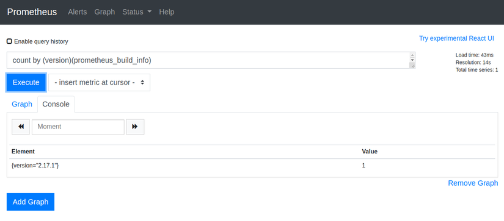

Acessando o menu **Status** > **Targets**, podemos ter uma visão geral dos exportadores e seus respectivos estados.

No menu **Graph** podemos realizar consultas das métricas coletadas pelos exportadores, por exemplo podemos utilizar o campo de **Expression** para buscar por `prometheus_build_info`:

O resultado dessa busca irá nos retornar algumas informações interessantes, como por exemplo o nome da instância e a porta onde o Prometheus está executando `instance="prometheus.dexter.com.br:9090"` e também o target do exporter `job="prometheus"` além de informar a versão do Prometheus `version="2.17.1"`.

Podemos também ocultar todas as informações e trazer apenas a versão do Prometheus executando a expressão `count by (version)(prometheus_build_info)`.

Dessa forma estamos filtrando o campo `version` da métrica `prometheus_build_info`, o campo Expression é muito importante para construir expressões que serão utilizadas nos gráficos apresentados no Grafana.
